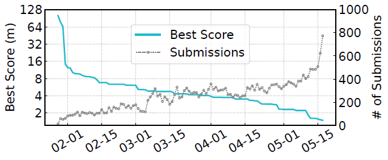
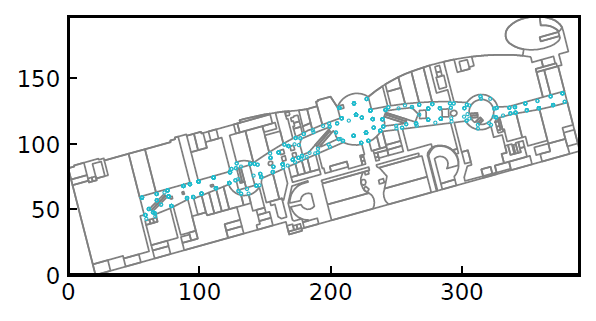

# Indoor Localization Competition

We organized an online fingerprint-based indoor localization competition in 2021. It attracted 1000+ teams worldwide. The teams were provided with a 60 GB dataset including WiFi, BLE, IMU, and geomagnetic field strength data collected from 200+ buildings to build their localization algorithms. The competition received 28,000+ submissions, and the daily condition is shown in the following figure. The top team achieved an average accuracy of 1.50m. Our work has been submitted to an international conference for peer review.



## Findings

We report some of our key findings and lessons from this large-scale competition as follows.

- Among the top 18 teams, 15 were from industry as opposed to academia. Almost all 18 teams' solutions include positioning, tracking, and optimization modules that vary widely. The core positioning algorithm ranges from simple machine learning (ML) such as KNN to sophisticated deep learning such as CNN and LSTM. The tracking algorithms are also heterogeneous, from traditional dead reckoning to deep learning.
- Regarding the localization accuracy, the top 18 teams achieve an average accuracy of no more than 3.7m (a median of no more than 2.6m), sufficient for typical use cases of smartphonebased indoor localization. The team who won the first place achieved an average localization accuracy of 1.50m. We believe this approximates the limit of fingerprint-based indoor localization using WiFi/BLE/IMU/GMF signals.
- For positioning (i.e., absolute localization), parameter tuning is more important than model selection. With fine tuning for a given floor or building, simple machine learning algorithms can outperform deep learning algorithms. In fact, somewhat surprisingly, we find that the top three teams all adopt KNN as a main component in their positioning models.

## Dataset

We release some data sample in the folder `data`. **The whole 60GB dataset is available on [kaggle](https://www.kaggle.com/c/indoor-location-navigation)**. The data are collected by surveyors using smartphones, and saved as trace files (i.e., fingerprints). For each floor of the building, we not only release its fingerprint data (in the folder `path_data_files`), but also publish the details of its floor information. The structure of `data` is shown as follows.

```
\---site1
    \---F2
        |   floor_image.png
        |   floor_info.json
        |   geojson_map.json
        |
        \---path_data_files
                5dda52069191710006b573b1.txt
                5de8de3b376b9d0006fdaa5d.txt
```

The detail information of each floor consists of  `floor_image.png`, showing the floor plan, `floor_info.json`, giving the width and height of the floor's bounding box, and `geojson_map.json`, describing the map of each point of interest (POI, e.g., Starbucks). Note that `geojson_map.json` uses the standard [GeoJSON](https://geojson.org) format to depict the POI map. Here we give a simple example, in which POIs and waypoints (or landmarks) are drawn with gray lines and green dots respectively.



In each trace file, there are two parts of data: **metadata** and **fingerprints**. The **metadata** contains the basic information of the collection (e.g., the site ID), and the **fingerprints** refer to the data we collect by smartphones. Please note that due to privacy considerations, we may delete (or change) some sensitive information (e.g., the collector name) in the public dataset. The fingerprints are composed of the following features.

- TYPE_ACCELEROMETER
- TYPE_MAGNETIC_FIELD
- TYPE_GYROSCOPE
- TYPE_ROTATION_VECTOR
- TYPE_MAGNETIC_FIELD_UNCALIBRATED
- TYPE_GYROSCOPE_UNCALIBRATED
- TYPE_ACCELEROMETER_UNCALIBRATED
- TYPE_WIFI
- TYPE_BEACON
- TYPE_WAYPOINT: ground truth location labeled by the surveyor

### Please find the details in `data-format.md`.


